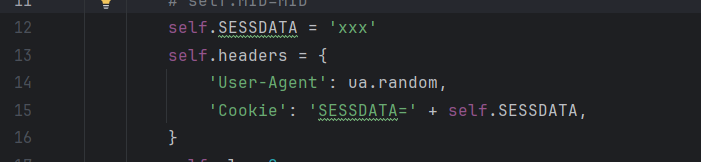
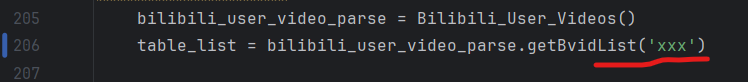

### 使用方法

#### 1.获取ID和SESSDATA

1. ID

   [【教程】如何查询自己的B站UID - 哔哩哔哩 (bilibili.com)](https://www.bilibili.com/read/cv10563065/#:~:text=第一步： 个人空间传送门,，点击转到自己的个人空间 第二部：找到自己的uid 红圈标注处即为uid)

2. SESSDATA

   [cookie登录b站获取cookie登录billbill教程_b站cookie怎么获取-CSDN博客](https://blog.csdn.net/qq_28821897/article/details/132002110)

#### 2.填入ID和SESSDATA

1. 第12行代码填入哔哩哔哩SESSDATA

   

2. 第206行代码填入哔哩哔哩MID号

   

3. 然后运行

### 需要和这个代理池项目一起使用

https://github.com/jhao104/proxy_pool

